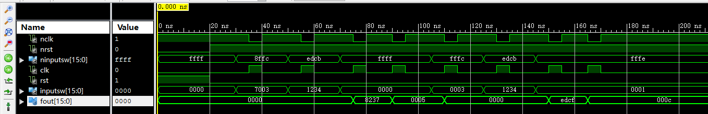

# Project 2: 16位ALU设计与实现

## 实验目的

1. 熟悉THINPAD硬件环境
2. 设计实现16位ALU及其控制器
3. 学习test bench写法以及仿真操作
4. 进一步锻炼硬件调试和测试能力

## 实验任务

1. 用VHDL设计实现16位ALU及其控制器
2. 使用THINPAD硬件平台测试

## 实验结果

### 仿真结果

**对ALU进行行为级仿真**

结果如图：


功能正确。

**对整体设计进行行为级仿真**

结果如图：



功能正确。

### 硬件测试结果

使用THINPAD硬件平台测试，功能正确。

## 源代码注解

### ALU部分

```vhdl
library IEEE;
use IEEE.std_logic_1164.all;
use IEEE.std_logic_unsigned.all;
use IEEE.numeric_std.all;
use work.constants.all;

entity alu is
    port
    (
        -- 操作码、操作数输入
        OP: in alu_op_t;
        OPERAND_0: in word_t;
        OPERAND_1: in word_t;

        -- 结果输出
        RESULT: out word_t;

        -- 标志位输出
        OVERFLOW: out std_logic;
        ZERO: out std_logic;
        SIGN: out std_logic;
        CARRY: out std_logic
    );
end;

architecture behavioral of alu is
    signal shamt: integer range 0 to word_msb;
    signal result_buff: word_t;
	 
    signal adder_operand_0, adder_operand_1: word_t;
    signal adder_carry_in: std_logic;
    signal adder_buff: std_logic_vector(word_msb + 1 downto 0);
begin
    -- 移位数量的类型转换，方便之后使用
    shamt <= to_integer(unsigned(OPERAND_1(3 downto 0)));
	 
    -- 定义了一个加法器
    adder_buff <= ("0" & adder_operand_0) + ("0" & adder_operand_1) + adder_carry_in;
	-- 计算输入给加法器的信号
    process(OP, OPERAND_0, OPERAND_1)
    begin
        adder_operand_0 <= OPERAND_0;
        -- 一个小选择器，根据加减法选择不同的输入给加法器的操作数
        if OP = alu_add then
            adder_operand_1 <= OPERAND_1;
            adder_carry_in <= '0';
        -- 对于减法的处理
	    else 
            adder_operand_1 <= not OPERAND_1;
            adder_carry_in <= '1';
        end if;
    end process;
    
    -- 计算进位（借位）、溢出标志
    process(OP, OPERAND_0, OPERAND_1, adder_buff)
    begin
        if OP = alu_add then
            -- 加法器的进位
            CARRY <= adder_buff(word_msb + 1);
      		-- 如果 正+正=负，或者 负+负=正，则说明溢出了
            if (OPERAND_0(word_msb) = '0' and OPERAND_1(word_msb) = '0' and adder_buff(word_msb) = '1')
               or (OPERAND_0(word_msb) = '1' and OPERAND_1(word_msb) = '1' and adder_buff(word_msb) = '0') then
                OVERFLOW <= '1';
            else
                OVERFLOW <= '0';
            end if;
        elsif OP = alu_sub then
            -- 加法器的进位取反，就是减法的借位信号
            CARRY <= not adder_buff(word_msb + 1);
            -- 如果 正-负=负，或者 负-正=正，则说明溢出了
            if (OPERAND_0(word_msb) = '0' and OPERAND_1(word_msb) = '1' and adder_buff(word_msb) = '1')
               or (OPERAND_0(word_msb) = '1' and OPERAND_1(word_msb) = '0' and adder_buff(word_msb) = '0') then
                OVERFLOW <= '1';
            else
                OVERFLOW <= '0';
            end if;
        else
            -- 其他操作进位和溢出都为0
            CARRY <= '0';
            OVERFLOW <= '0';
        end if;
    end process;

    -- 大选择器，根据操作码选择对应的结果
    process(OP, OPERAND_0, OPERAND_1, shamt, adder_buff)
    begin
        case OP is
            when alu_add | alu_sub =>
                result_buff <= adder_buff(word_msb downto 0);
            when alu_and =>
                result_buff <= OPERAND_0 and OPERAND_1;
            when alu_or =>
                result_buff <= OPERAND_0 or OPERAND_1;
            when alu_xor =>
                result_buff <= OPERAND_0 xor OPERAND_1;
            when alu_not =>
                result_buff <= not OPERAND_0;
            when alu_sll =>
                result_buff <= to_stdlogicvector(to_bitvector(OPERAND_0) sll shamt);
            when alu_srl =>
                result_buff <= to_stdlogicvector(to_bitvector(OPERAND_0) srl shamt);
            when alu_sra =>
                result_buff <= to_stdlogicvector(to_bitvector(OPERAND_0) sra shamt);
            when alu_rol =>
                result_buff <= to_stdlogicvector(to_bitvector(OPERAND_0) rol shamt);
            when others =>
                result_buff <= (others => 'X');
        end case;
    end process;
	
    -- 输出结果
    RESULT <= result_buff;
    
    -- 其余标志位计算
    ZERO <= '1' when result_buff = zero_word else '0';
    SIGN <= result_buff(word_msb);
end;
```

### 控制器部分

```vhdl
library IEEE;
use IEEE.std_logic_1164.all;
use work.constants.all;

entity controller is
    port
    (
      	-- 单步时钟及复位键
        nCLK: in std_logic; 
        nRST: in std_logic;
        -- 输入及输出
      	nInputSW: in word_t;
        fout: out word_t
    );
end;

architecture behavioral of controller is
    component alu is 
        port
        (
            -- 数据及操作码输入
            OP: in alu_op_t;
            OPERAND_0: in word_t;
            OPERAND_1: in word_t;

            -- 输出
            RESULT: out word_t;

            -- 标志位输出
            OVERFLOW: out std_logic;
            ZERO: out std_logic;
            SIGN: out std_logic;
            CARRY: out std_logic
        );
    end component;
    type state is (s_inputA, s_inputB, s_inputOP, s_outputFout, s_outputFlag);
    signal current_state: state;
    
    signal clk, rst: std_logic;
    signal InputSW: word_t;

    signal OP: alu_op_t;
    signal OPERAND_0: word_t;
    signal OPERAND_1: word_t;
    signal result: word_t;
    signal output: word_t;
    signal OVERFLOW: std_logic;
    signal ZERO: std_logic;
    signal SIGN: std_logic;
    signal CARRY: std_logic;
begin
    clk <= not nCLK;
    rst <= not nRST;
    InputSW <= not nInputSW;

    fout <= output;

	-- 实例化ALU
    alu_inst: alu
    port map
    (
        -- 数据及操作码输入
        OP => OP,
        OPERAND_0 => OPERAND_0,
        OPERAND_1 => OPERAND_1,

        -- 输出
        RESULT => result,

        -- 标志位输出
        OVERFLOW => OVERFLOW,
        ZERO => ZERO,
        SIGN => SIGN,
        CARRY => CARRY
    );

    main : process(clk, rst)
    begin
        -- 复位
        if rst = '1' then
            current_state <= s_inputA;
        elsif rising_edge(clk) then
            case current_state is
                -- 输入操作数A
                when s_inputA =>
                    OPERAND_0 <= InputSW;
                    current_state <= s_inputB;
                -- 输入操作数B
                when s_inputB =>
                    OPERAND_1 <= InputSW;   
                    current_state <= s_inputOP;
                -- 输入操作码
                when s_inputOP =>
                    OP <= InputSW(3 downto 0);
                    current_state <= s_outputFout;
                -- 输出操作结果
                when s_outputFout =>
                    current_state <= s_outputFlag;
                -- 输出标志位
                when s_outputFlag =>
                    OPERAND_0 <= InputSW;
                    current_state <= s_inputB;
                when others =>
                    current_state <= s_inputA;
            end case;
        end if;
    end process;

    -- 输出操作结果及标志位
    output_proc : process(current_state, result, OVERFLOW, ZERO, SIGN, CARRY)
    begin
        case current_state is
            -- 输出操作结果
            when s_outputFout =>
                output <= result;
            -- 输出标志位
            when s_outputFlag =>
                output <= (others => '0');
                output(0) <= OVERFLOW;
                output(1) <= ZERO;
                output(2) <= SIGN;
                output(3) <= CARRY;
            when others =>
                output <= (others => '0');
        end case;
    end process;
end;
```

## 面积优化

ALU中一个核心部件是加法器，虽然FPGA有硬件加法器，但是一个16位加（减）法器仍然需要比较多的资源。如果把加法和减法的结果都计算出来之后再进行选择，就会综合出两个16位加（减）法器，但是如果在计算之前对输入给加法器的操作数进行选择，那么加法和减法可以使用同一个加法器，节约了硬件资源，同时减少了电路的面积。 

有的时候逻辑电路的面积减小了，布线延迟也会变小，速度反而会快。

## 思考题

**ALU是组合逻辑电路还是时序逻辑电路？**

是组合逻辑电路。

**给定A和B初值，要求运算完毕结果写回B，再进行下一次运算，应增加什么电路？**

需要添加寄存器（即一组触发器），以及修改状态机，增加写回的状态。